    library(tidyr)
    library(dplyr)

    ## 
    ## Attaching package: 'dplyr'

    ## The following objects are masked from 'package:stats':
    ## 
    ##     filter, lag

    ## The following objects are masked from 'package:base':
    ## 
    ##     intersect, setdiff, setequal, union

    library(ggplot2)
    library(ambient)

    colours <- c(
      red = "#F14A14",
      orange = "#FF9316",
      yellow = "#FBC21B",
      darkpink = "#F65A82",
      lightpink = "#FD96B8",
      darkblue = "#4A3DFB",
      lightblue = "#8DD8F8",
      purple = "#B38AD9",
      lightgreen = "#C1F213"
    )

    grid <- crossing(x = 1:30, y = 1:30)

    plot_grid <- function(data) {
      data %>%
        ggplot() +
        geom_tile(aes(x = x, y = y, fill = colour, width = 0.9, height = 0.9)) +
        scale_fill_identity() +
        coord_fixed() +
        theme_void()
    }

    colour_from_noise <- function(data) {
      data %>%
        # bin into groups and choose colour from there
        mutate(
          colour = ntile(noise, length(colours)),
          colour = colours[colour]
        )
    }

# Random sample

    set.seed(1234)

    grid %>%
      rowwise() %>%
      mutate(colour = sample(colours, 1)) %>%
      ungroup() %>%
      plot_grid()

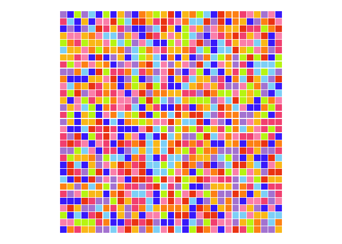

# Cubic

    grid %>%
      mutate(noise = gen_cubic(x, y, seed = 1234)) %>%
      colour_from_noise() %>%
      plot_grid()

    grid %>%
      mutate(noise = gen_cubic(x, y, seed = 1234, frequency = 0.5)) %>%
      colour_from_noise() %>%
      plot_grid()

    grid %>%
      mutate(noise = gen_cubic(x, y, seed = 1234, frequency = 0.2)) %>%
      colour_from_noise() %>%
      plot_grid()

    grid %>%
      mutate(noise = gen_cubic(x, y, seed = 1234, frequency = 0.1)) %>%
      colour_from_noise() %>%
      plot_grid()

# Perlin

    grid %>%
      mutate(noise = gen_perlin(x, y, seed = 1234, frequency = 0.95)) %>%
      colour_from_noise() %>%
      plot_grid()

    grid %>%
      mutate(noise = gen_perlin(x, y, seed = 1234, frequency = 0.5)) %>%
      colour_from_noise() %>%
      plot_grid()

    grid %>%
      mutate(noise = gen_perlin(x, y, seed = 1234, frequency = 0.4)) %>%
      colour_from_noise() %>%
      plot_grid()

    grid %>%
      mutate(noise = gen_perlin(x, y, seed = 1234, frequency = 0.25)) %>%
      colour_from_noise() %>%
      plot_grid()

    grid %>%
      mutate(noise = gen_perlin(x, y, seed = 1234, frequency = 0.2)) %>%
      colour_from_noise() %>%
      plot_grid()

    grid %>%
      mutate(noise = gen_perlin(x, y, seed = 1234, frequency = 0.15)) %>%
      colour_from_noise() %>%
      plot_grid()

    grid %>%
      mutate(noise = gen_perlin(x, y, seed = 1234, frequency = 0.1)) %>%
      colour_from_noise() %>%
      plot_grid()

    grid %>%
      mutate(noise = gen_perlin(x, y, seed = 1234, frequency = 0.05)) %>%
      colour_from_noise() %>%
      plot_grid()

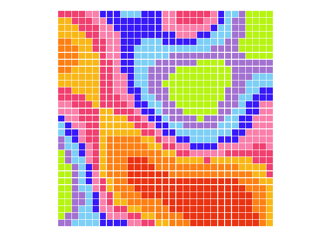

    grid %>%
      mutate(noise = gen_perlin(x, y, seed = 1234, frequency = 0.01)) %>%
      colour_from_noise() %>%
      plot_grid()

    grid %>%
      mutate(noise = gen_perlin(x, y, seed = 1234, frequency = 0.001)) %>%
      colour_from_noise() %>%
      plot_grid()

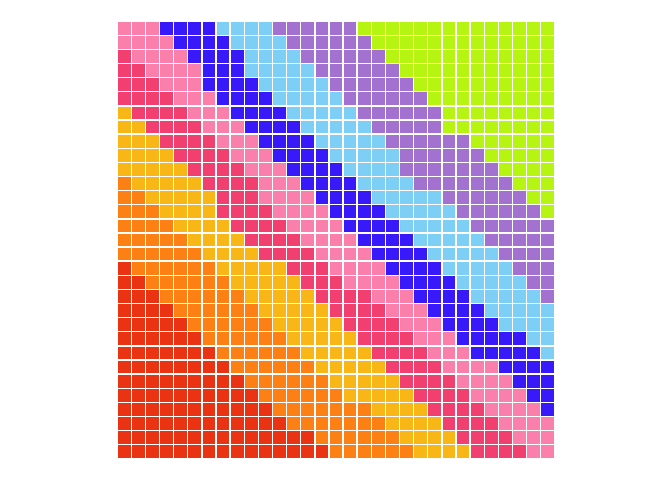

# Simplex

    grid %>%
      mutate(noise = gen_simplex(x, y, seed = 1234, frequency = 1)) %>%
      colour_from_noise() %>%
      plot_grid()

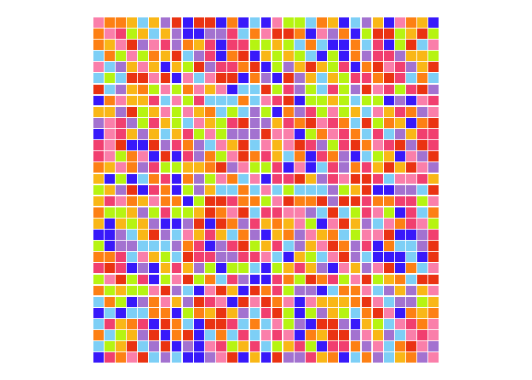

    grid %>%
      mutate(noise = gen_simplex(x, y, seed = 1234, frequency = 0.5)) %>%
      colour_from_noise() %>%
      plot_grid()

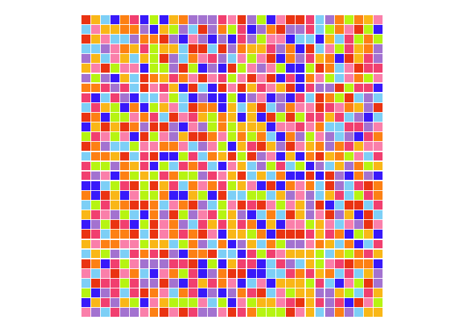

    grid %>%
      mutate(noise = gen_simplex(x, y, seed = 1234, frequency = 0.25)) %>%
      colour_from_noise() %>%
      plot_grid()

    grid %>%
      mutate(noise = gen_simplex(x, y, seed = 1234, frequency = 0.1)) %>%
      colour_from_noise() %>%
      plot_grid()

    grid %>%
      mutate(noise = gen_simplex(x, y, seed = 1234, frequency = 0.075)) %>%
      colour_from_noise() %>%
      plot_grid()

    grid %>%
      mutate(noise = gen_simplex(x, y, seed = 1234, frequency = 0.05)) %>%
      colour_from_noise() %>%
      plot_grid()

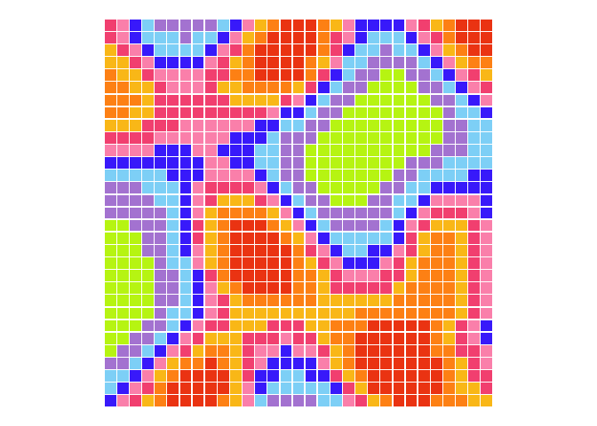

    grid %>%
      mutate(noise = gen_simplex(x, y, seed = 1234, frequency = 0.01)) %>%
      colour_from_noise() %>%
      plot_grid()

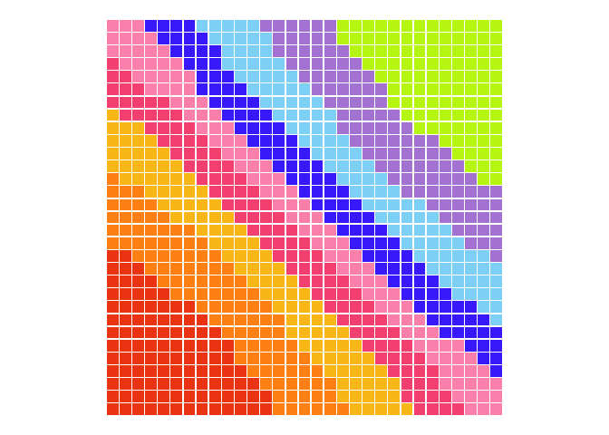

# Spheres

    grid %>%
      mutate(noise = gen_spheres(x, y, seed = 1234, frequency = 1)) %>%
      colour_from_noise() %>%
      plot_grid()

    grid %>%
      mutate(noise = gen_spheres(x, y, seed = 1234, frequency = 0.75)) %>%
      colour_from_noise() %>%
      plot_grid()

    grid %>%
      mutate(noise = gen_spheres(x, y, seed = 1234, frequency = 0.5)) %>%
      colour_from_noise() %>%
      plot_grid()

    grid %>%
      mutate(noise = gen_spheres(x, y, seed = 1234, frequency = 0.25)) %>%
      colour_from_noise() %>%
      plot_grid()

    grid %>%
      mutate(noise = gen_spheres(x, y, seed = 1234, frequency = 0.1)) %>%
      colour_from_noise() %>%
      plot_grid()

    grid %>%
      mutate(noise = gen_spheres(x, y, seed = 1234, frequency = 0.075)) %>%
      colour_from_noise() %>%
      plot_grid()

    grid %>%
      mutate(noise = gen_spheres(x, y, seed = 1234, frequency = 0.05)) %>%
      colour_from_noise() %>%
      plot_grid()

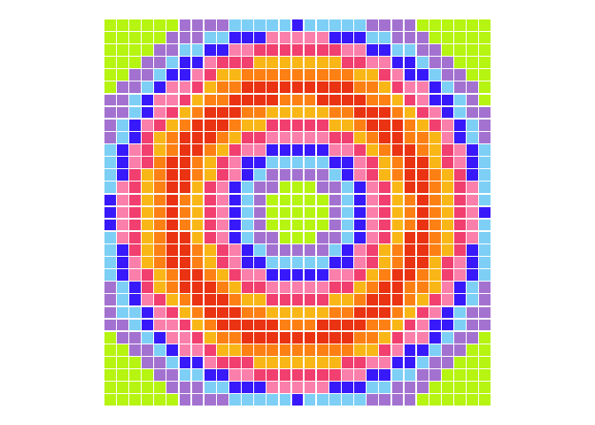

    grid %>%
      mutate(noise = gen_spheres(x, y, seed = 1234, frequency = 0.01)) %>%
      colour_from_noise() %>%
      plot_grid()

# Waves

    grid %>%
      mutate(noise = gen_waves(x, y, seed = 1234, frequency = 1)) %>%
      colour_from_noise() %>%
      plot_grid()

    grid %>%
      mutate(noise = gen_waves(x, y, seed = 1234, frequency = 0.75)) %>%
      colour_from_noise() %>%
      plot_grid()

    grid %>%
      mutate(noise = gen_waves(x, y, seed = 1234, frequency = 0.5)) %>%
      colour_from_noise() %>%
      plot_grid()

    grid %>%
      mutate(noise = gen_waves(x, y, seed = 1234, frequency = 0.25)) %>%
      colour_from_noise() %>%
      plot_grid()

    grid %>%
      mutate(noise = gen_waves(x, y, seed = 1234, frequency = 0.1)) %>%
      colour_from_noise() %>%
      plot_grid()

    grid %>%
      mutate(noise = gen_waves(x, y, seed = 1234, frequency = 0.075)) %>%
      colour_from_noise() %>%
      plot_grid()

    grid %>%
      mutate(noise = gen_waves(x, y, seed = 1234, frequency = 0.05)) %>%
      colour_from_noise() %>%
      plot_grid()

    grid %>%
      mutate(noise = gen_waves(x, y, seed = 1234, frequency = 0.01)) %>%
      colour_from_noise() %>%
      plot_grid()

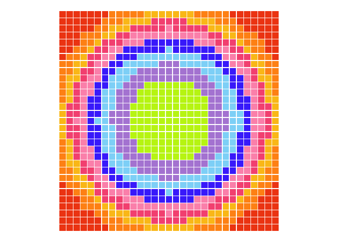

# White

    grid %>%
      mutate(noise = gen_white(x, y, seed = 1234, frequency = 1)) %>%
      colour_from_noise() %>%
      plot_grid()

    grid %>%
      mutate(noise = gen_white(x, y, seed = 1234, frequency = 0.00001)) %>%
      colour_from_noise() %>%
      plot_grid()

# Worley

    grid %>%
      mutate(noise = gen_worley(x, y, seed = 1234, frequency = 1)) %>%
      colour_from_noise() %>%
      plot_grid()

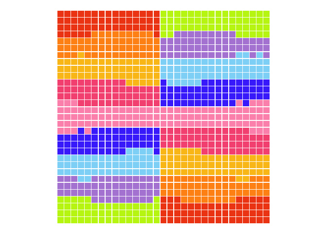

    grid %>%
      mutate(noise = gen_worley(x, y, seed = 1234, frequency = 0.75)) %>%
      colour_from_noise() %>%
      plot_grid()

    grid %>%
      mutate(noise = gen_worley(x, y, seed = 1234, frequency = 0.5)) %>%
      colour_from_noise() %>%
      plot_grid()

    grid %>%
      mutate(noise = gen_worley(x, y, seed = 1234, frequency = 0.25)) %>%
      colour_from_noise() %>%
      plot_grid()

    grid %>%
      mutate(noise = gen_worley(x, y, seed = 1234, frequency = 0.1)) %>%
      colour_from_noise() %>%
      plot_grid()

    grid %>%
      mutate(noise = gen_waves(x, y, seed = 1234, frequency = 0.075)) %>%
      colour_from_noise() %>%
      plot_grid()

    grid %>%
      mutate(noise = gen_worley(x, y, seed = 1234, frequency = 0.05)) %>%
      colour_from_noise() %>%
      plot_grid()

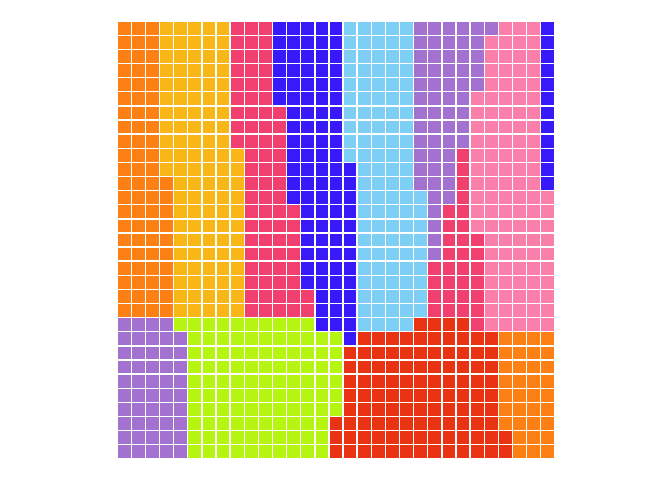

    grid %>%
      mutate(noise = gen_worley(x, y, seed = 1234, frequency = 0.01)) %>%
      colour_from_noise() %>%
      plot_grid()

