    library(prismatic)
    library(dplyr, warn.conflicts = FALSE)
    library(ambient)
    library(tidyr)
    library(ggplot2)

    source(here::here("generate_noise.R"))

    colours <- c(
      red = "#F14A14",
      orange = "#FF9316",
      yellow = "#FBC21B",
      darkpink = "#F65A82",
      lightpink = "#FD96B8",
      darkblue = "#4A3DFB",
      lightblue = "#8DD8F8",
      purple = "#B38AD9",
      lightgreen = "#C1F213"
    )

    grid <- crossing(x = -100:100, y = -100:100)

    shift_colour_from_noise <- function(data, colour = colours[["red"]], shift = 0.25) {
      grid_colours <- clr_darken(rep(colour, nrow(data)), shift = data$noise * shift, "HSL")

      data$colour <- grid_colours

      data
    }

    plot_grid <- function(data) {
      ggplot() +
        geom_point(data = data, aes(x = x, y = y, colour = colour), shape = 15, size = 0.75) +
        scale_colour_identity() +
        coord_fixed() +
        theme_void()
    }

    plot_noisy_colour <- function(data, noise, frequency, seed = 1234, colour = colours[["red"]], normalise = FALSE) {
      data %>%
        generate_noise(noise, frequency, seed, normalise) %>%
        shift_colour_from_noise(colour) %>%
        plot_grid()
    }

# Random sample

    set.seed(1234)

    grid %>%
      rowwise() %>%
      mutate(noise = runif(1, -1, 1)) %>%
      ungroup() %>%
      shift_colour_from_noise() %>%
      plot_grid()

# Cubic

    grid %>%
      plot_noisy_colour("cubic", 1)

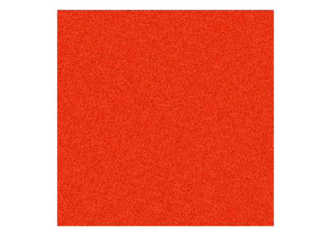

    grid %>%
      plot_noisy_colour("cubic", 0.5)

    grid %>%
      plot_noisy_colour("cubic", 0.25)

    grid %>%
      plot_noisy_colour("cubic", 0.1)

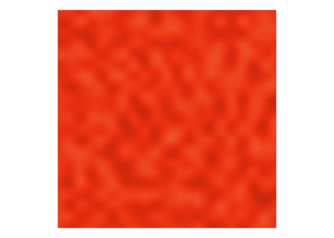

    grid %>%
      plot_noisy_colour("cubic", 0.05)

    grid %>%
      plot_noisy_colour("cubic", 0.01)

# Perlin

    grid %>%
      plot_noisy_colour("perlin", 0.99)

    grid %>%
      plot_noisy_colour("perlin", 0.5)

    grid %>%
      plot_noisy_colour("perlin", 0.25)

    grid %>%
      plot_noisy_colour("perlin", 0.1)

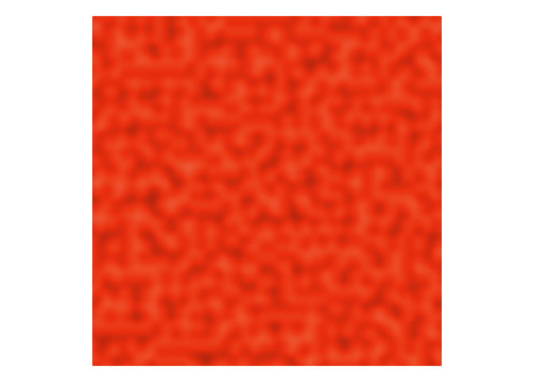

    grid %>%
      plot_noisy_colour("perlin", 0.05)

    grid %>%
      plot_noisy_colour("perlin", 0.01)

# Simplex

    grid %>%
      plot_noisy_colour("simplex", 1)

    grid %>%
      plot_noisy_colour("simplex", 0.5)

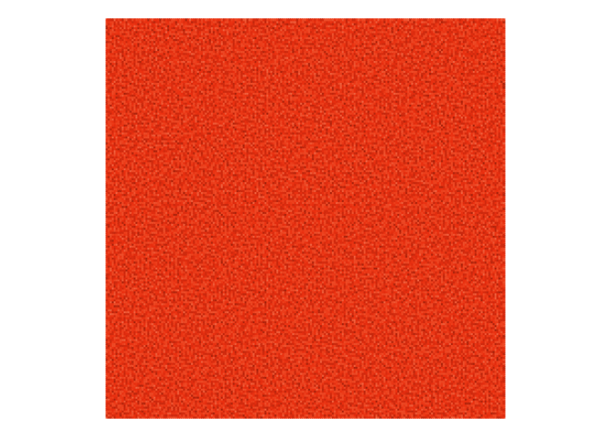

    grid %>%
      plot_noisy_colour("simplex", 0.25)

    grid %>%
      plot_noisy_colour("simplex", 0.1)

    grid %>%
      plot_noisy_colour("simplex", 0.05)

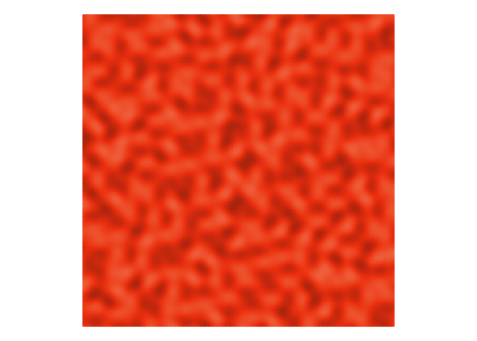

    grid %>%
      plot_noisy_colour("simplex", 0.01)

# Spheres

    grid %>%
      plot_noisy_colour("spheres", 1)

    grid %>%
      plot_noisy_colour("spheres", 0.5)

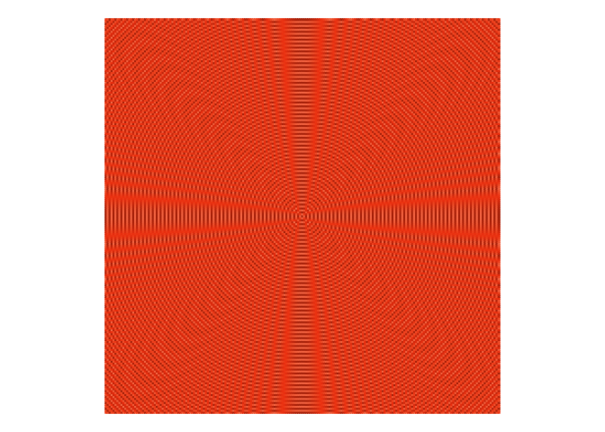

    grid %>%
      plot_noisy_colour("spheres", 0.25)

    grid %>%
      plot_noisy_colour("spheres", 0.1)

    grid %>%
      plot_noisy_colour("spheres", 0.05)

    grid %>%
      plot_noisy_colour("spheres", 0.01)

# Waves

    grid %>%
      plot_noisy_colour("waves", 1)

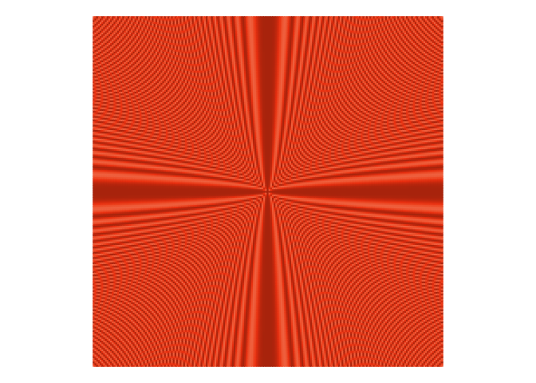

    grid %>%
      plot_noisy_colour("waves", 0.5)

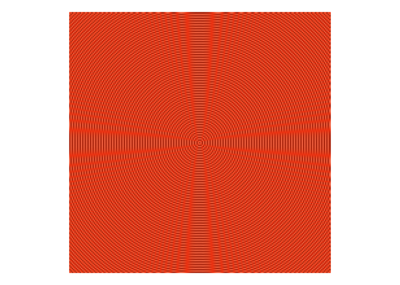

    grid %>%
      plot_noisy_colour("waves", 0.25)

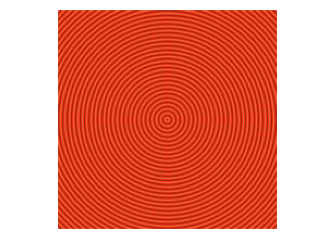

    grid %>%
      plot_noisy_colour("waves", 0.1)

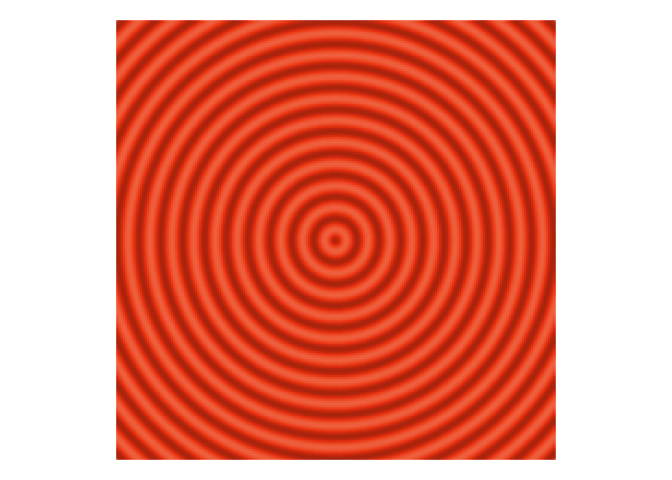

    grid %>%
      plot_noisy_colour("waves", 0.05)

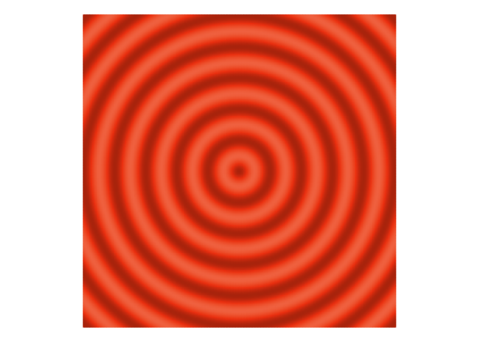

    grid %>%
      plot_noisy_colour("waves", 0.01)

# White

    grid %>%
      plot_noisy_colour("white", 0.99)

    grid %>%
      plot_noisy_colour("white", 0.5)

    grid %>%
      plot_noisy_colour("white", 0.25)

    grid %>%
      plot_noisy_colour("white", 0.1)

    grid %>%
      plot_noisy_colour("white", 0.05)

    grid %>%
      plot_noisy_colour("white", 0.01)

# Worley

    grid %>%
      plot_noisy_colour("worley", 1)

    grid %>%
      plot_noisy_colour("worley", 0.5)

    grid %>%
      plot_noisy_colour("worley", 0.25)

    grid %>%
      plot_noisy_colour("worley", 0.1)

    grid %>%
      plot_noisy_colour("worley", 0.05)

    grid %>%
      plot_noisy_colour("worley", 0.01)

