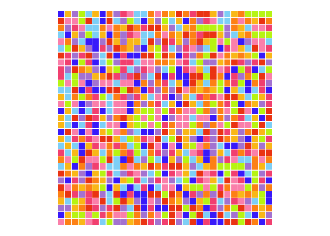

``` r
library(tidyr)
library(dplyr, warn.conflicts = FALSE)
library(ggplot2)
library(ambient)

source(here::here("generate_noise.R"))

colours <- c(
  red = "#F14A14",
  orange = "#FF9316",
  yellow = "#FBC21B",
  darkpink = "#F65A82",
  lightpink = "#FD96B8",
  darkblue = "#4A3DFB",
  lightblue = "#8DD8F8",
  purple = "#B38AD9",
  lightgreen = "#C1F213"
)

grid <- crossing(x = -15:15, y = -15:15)

colour_from_noise <- function(data) {
  data %>%
    # bin into groups and choose colour from there
    mutate(
      colour = ntile(noise, length(colours)),
      colour = colours[colour]
    )
}

plot_grid <- function(data) {
  data %>%
    ggplot() +
    geom_tile(aes(x = x, y = y, fill = colour, width = 0.9, height = 0.9)) +
    scale_fill_identity() +
    coord_fixed() +
    theme_void()
}

plot_noise_colours <- function(data, noise, frequency, seed = 1234, normalise = FALSE) {
  data %>%
    generate_noise(noise, frequency, seed, normalise) %>%
    colour_from_noise() %>%
    plot_grid()
}
```

# Random sample

``` r
set.seed(1234)

grid %>%
  rowwise() %>%
  mutate(colour = sample(colours, 1)) %>%
  ungroup() %>%
  plot_grid()
```

<!-- -->

# Cubic

``` r
grid %>%
  plot_noise_colours("cubic", 1)
```

<!-- -->

``` r
grid %>%
  plot_noise_colours("cubic", 0.5)
```

<!-- -->

``` r
grid %>%
  plot_noise_colours("cubic", 0.25)
```

<!-- -->

``` r
grid %>%
  plot_noise_colours("cubic", 0.1)
```

<!-- -->

``` r
grid %>%
  plot_noise_colours("cubic", 0.05)
```

<!-- -->

``` r
grid %>%
  plot_noise_colours("cubic", 0.01)
```

<!-- -->

# Perlin

``` r
grid %>%
  plot_noise_colours("perlin", 1)
```

<!-- -->

``` r
grid %>%
  plot_noise_colours("perlin", 0.5)
```

<!-- -->

``` r
grid %>%
  plot_noise_colours("perlin", 0.25)
```

<!-- -->

``` r
grid %>%
  plot_noise_colours("perlin", 0.1)
```

<!-- -->

``` r
grid %>%
  plot_noise_colours("perlin", 0.05)
```

<!-- -->

``` r
grid %>%
  plot_noise_colours("perlin", 0.01)
```

<!-- -->

# Simplex

``` r
grid %>%
  plot_noise_colours("simplex", 1)
```

<!-- -->

``` r
grid %>%
  plot_noise_colours("simplex", 0.5)
```

<!-- -->

``` r
grid %>%
  plot_noise_colours("simplex", 0.25)
```

<!-- -->

``` r
grid %>%
  plot_noise_colours("simplex", 0.1)
```

<!-- -->

``` r
grid %>%
  plot_noise_colours("simplex", 0.05)
```

<!-- -->

``` r
grid %>%
  plot_noise_colours("simplex", 0.01)
```

<!-- -->

# Spheres

``` r
grid %>%
  plot_noise_colours("spheres", 1)
```

<!-- -->

``` r
grid %>%
  plot_noise_colours("spheres", 0.5)
```

<!-- -->

``` r
grid %>%
  plot_noise_colours("spheres", 0.25)
```

<!-- -->

``` r
grid %>%
  plot_noise_colours("spheres", 0.1)
```

<!-- -->

``` r
grid %>%
  plot_noise_colours("spheres", 0.05)
```

<!-- -->

``` r
grid %>%
  plot_noise_colours("spheres", 0.01)
```

<!-- -->

# Waves

``` r
grid %>%
  plot_noise_colours("waves", 1)
```

<!-- -->

``` r
grid %>%
  plot_noise_colours("waves", 0.5)
```

<!-- -->

``` r
grid %>%
  plot_noise_colours("waves", 0.25)
```

<!-- -->

``` r
grid %>%
  plot_noise_colours("waves", 0.1)
```

<!-- -->

``` r
grid %>%
  plot_noise_colours("waves", 0.05)
```

<!-- -->

``` r
grid %>%
  plot_noise_colours("waves", 0.01)
```

<!-- -->

# White

``` r
grid %>%
  plot_noise_colours("white", 1)
```

<!-- -->

``` r
grid %>%
  plot_noise_colours("white", 0.5)
```

<!-- -->

``` r
grid %>%
  plot_noise_colours("white", 0.25)
```

<!-- -->

``` r
grid %>%
  plot_noise_colours("white", 0.1)
```

<!-- -->

``` r
grid %>%
  plot_noise_colours("white", 0.05)
```

<!-- -->

``` r
grid %>%
  plot_noise_colours("white", 0.01)
```

<!-- -->

# Worley

``` r
grid %>%
  plot_noise_colours("worley", 1)
```

<!-- -->

``` r
grid %>%
  plot_noise_colours("worley", 0.5)
```

<!-- -->

``` r
grid %>%
  plot_noise_colours("worley", 0.25)
```

<!-- -->

``` r
grid %>%
  plot_noise_colours("worley", 0.1)
```

<!-- -->

``` r
grid %>%
  plot_noise_colours("worley", 0.05)
```

<!-- -->

``` r
grid %>%
  plot_noise_colours("worley", 0.01)
```

<!-- -->
